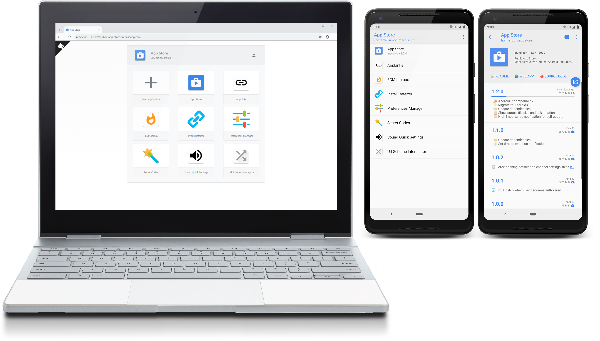
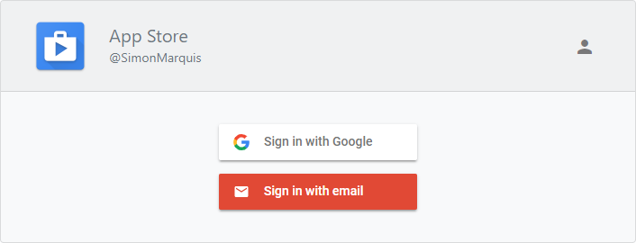
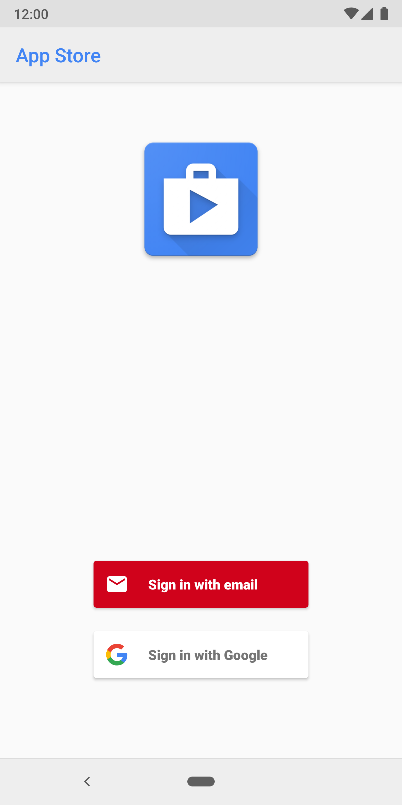
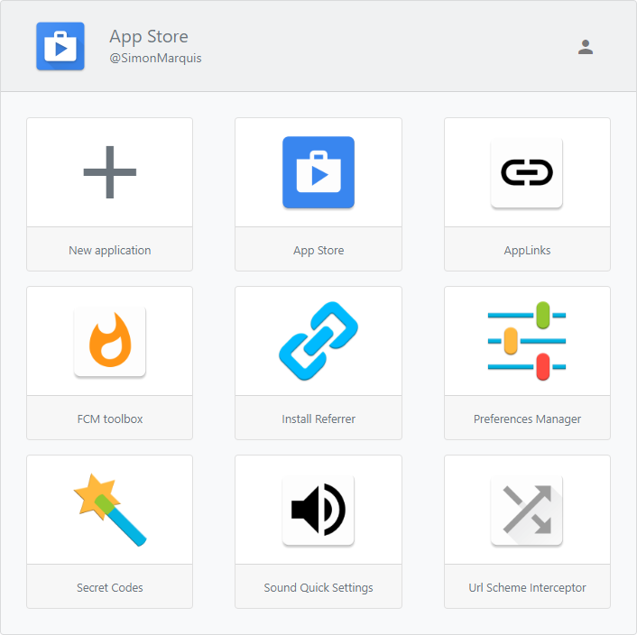
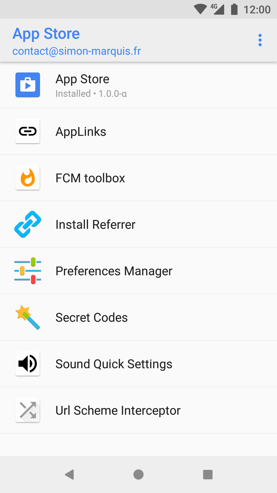
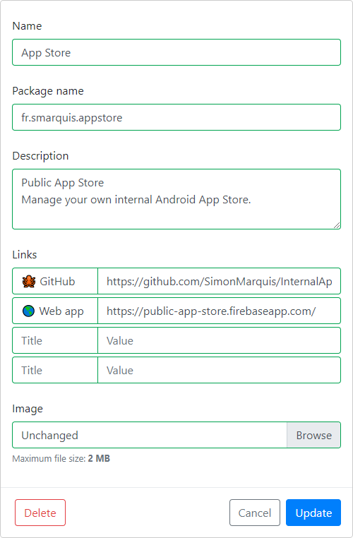
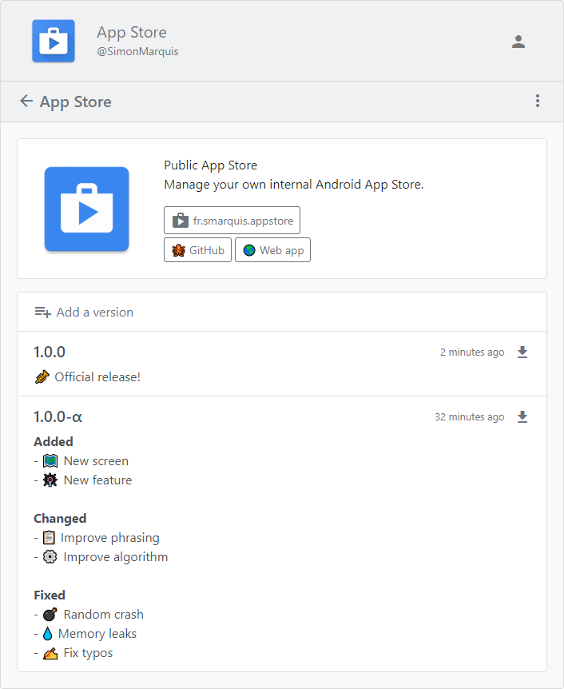
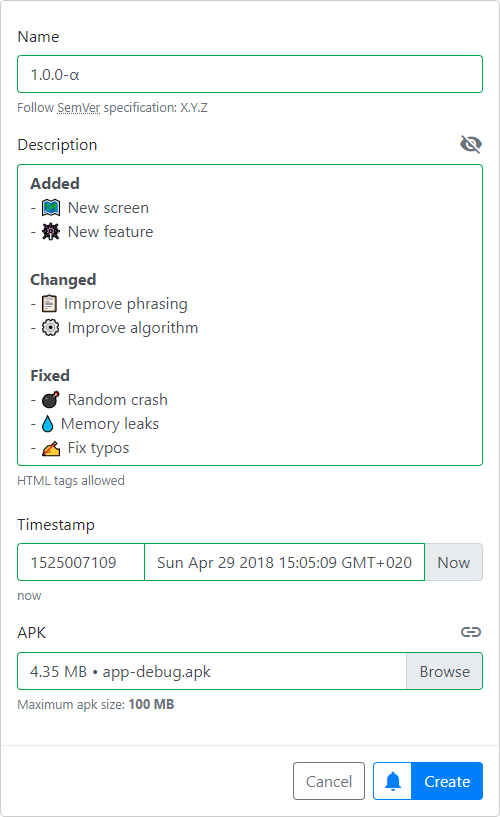

<div align="center">
  
</div>
<h3 align="center">Internal App Store</h3>
<p align="center">
  Manage your own internal Android App Store.<br>
  <a href="https://public-app-store.web.app/"><strong>Web app</strong></a> • <a href="https://github.com/SimonMarquis/InternalAppStore/releases"><strong>Android app</strong></a><br>
  <a href="https://github.com/SimonMarquis/InternalAppStore/actions/workflows/android.yml"></a>
</p>

<br>



## Table of contents

<!-- MarkdownTOC levels="2" -->

- [Demo](#demo)
- [Features](#features)
- [Deploy](#deploy)
- [Settings](#settings)
- [Backup](#backup)
- [License](#license)

<!-- /MarkdownTOC -->

## Demo

A public version of the web app is hosted on [public-app-store.web.app](https://public-app-store.web.app).  
The latest Android apk can also be downloaded [here](https://github.com/SimonMarquis/InternalAppStore/releases).

## Features

- Public or private access to the store
  + User roles (anonymous or verified users)
  + Account restrictions (only admins have write access)

  <br>
  <details>
  <summary>📷 <b><i>Screenshots</i></b></summary>

  | Web | Android |
  |:---:|:---:|
  |  |  |

  </details>
- Manage multiple applications
  + Notifications for new applications
  + Description with html support
  + Shortcuts for frequent actions

  <br>
  <details>
  <summary>📷 <b><i>Screenshots</i></b></summary>

  | Web | Android |
  |:---:|:---:|
  |  |  |
  |  |  |
  |  |  |

  </details>
- Manage multiple versions
  + Notifications for new versions
  + Upload apks or external links
  + Changelog with html support
  + Apk files are cached

  <br>
  <details>
  <summary>📷 <b><i>Screenshots</i></b></summary>

  | Web | Android |
  |:---:|:---:|
  |  |  |
  |  |  |

  </details>

## Deploy

> Requirements
> - [Android Studio](https://developer.android.com/studio/)
> - [Firebase account](https://console.firebase.google.com)
> - [Firebase CLI](https://github.com/firebase/firebase-tools)

#### Configure

- Replace `applicationId` with your own unique id in [app/build.gradle](app/build.gradle#L15)
- Create a Firebase project https://console.firebase.google.com
- Select `Add Firebase to your Android app` and fill in the form
- Download the config file `google-services.json` and move it to your [Android app module root directory](app/)
- In the Firebase Authentication page, enable sign-in methods, then create your first admin user
- In the Firebase project settings, select `ADD APP` and `Add Firebase to your web app`
- When using Firebase Hosting and the CLI, [Web SDK auto-configuration](https://firebase.googleblog.com/2017/04/easier-configuration-for-firebase-on-web.html) is [enabled by default](https://github.com/SimonMarquis/InternalAppStore/commit/2b94dd0e7e1614a06a3126f57e2fb69cfeeab257)
- Verify the configuration of each module
  + Android: [Store.kt](app/src/main/java/fr/smarquis/appstore/Store.kt#L18-L30)
  + Web: [index.js](firebase/hosting/index.js#L5-L23)
  + Firebase Database: use your own domain
    * [database-private.rules.json (read access)](firebase/database/database-private.rules.json#L19-L20)
    <details>
    <summary>Database schema</summary>

    ```
    ├──admins
    │   └──{$uid}
    ├──store
    │   ├──applications
    │   │   └──{$application_id}
    │   │       ├──name
    │   │       ├──packageName
    │   │       ├──description
    │   │       ├──image
    │   │       ├──link_{#}
    │   │       │   ├──name
    │   │       │   └──uri
    │   │       └──silent
    │   └──versions
    │       └──{$application_id}
    │           └──{$version_id}
    │               ├──name
    │               ├──description
    │               ├──timestamp
    │               ├──apkRef
    │               ├──apkGeneration
    │               ├──apkUrl
    │               ├──silent
    │               ├──downloads
    │               └──installs
    └──analytics
        ├──downloads
        │   └──{$application_id}
        │       └──{$version_id}
        │           └──{$uid}
        └──installs
            └──{$application_id}
                └──{$version_id}
                    └──{$uid}
    ```

    </details>
  + Firebase Storage: use your own domain
    * [storage-private.rules (images)](firebase/storage/storage-private.rules#L6-L7)
    * [storage-private.rules (apks)](firebase/storage/storage-private.rules#L21-L22)
    <details>
    <summary>Storage schema</summary>

    ```
    └──applications
        └──{$applicationUid}
            │──image
            └──versions
                └──{$versionUid}.apk
    ```

    </details>

#### Initialize

- Initialize Firebase module
  ```bash
  # Move to Firebase root directory
  cd firebase
  # Initialize Firebase (login popup)
  firebase login
  # Set the default Firebase project
  firebase use --add
  ```
- Add your first admin user (`uid` found in Firebase Authentication page)
  + Firebase Database, add admin `uid`
    ```bash
    firebase database:update /admins --data '{"<admin-uid>" : "<admin-email>"}'
    # On Windows, create a JSON file instead (unsupported JSON input)
    firebase database:update /admins update.json
    ```
  + Firebase Storage, add admin `uid`
    * [storage-private.rules (images)](firebase/storage/storage-private.rules#L8-L9)
    * [storage-private.rules (apks)](firebase/storage/storage-private.rules#L23-L24)

#### Deploy

- Test web app on your machine http://localhost:5000
  ```bash
  firebase serve
  ```
- Deploy all Firebase modules (database, storage, hosting, functions)
  ```bash
  firebase deploy
  ```
- Sync, build and install Android module from Android Studio

## Settings

A lot of settings can be tweaked in both web and Android apps
- Store icons and titles
- Firebase auth providers
- Maximum apk size
- Admin write access
- Store visibility (private or public)
- …

## Backup

- *Firebase Database* ([Link 1](https://firebase.googleblog.com/2017/12/read-and-write-your-realtime-database.html), [Link 2](https://firebase.google.com/docs/database/backups))
  ```bash
  // Backup
  firebase database:get / --pretty > database.json
  // Restore
  firebase database:set / database.json
  ```
- *Firebase Storage* ([Link](https://stackoverflow.com/questions/46369844/is-it-a-way-to-backup-data-in-firebase-storage))
  ```bash
  // Backup
  gsutil -m cp -R gs://<bucket_name> .
  // Restore
  gsutil -m cp -R . gs://<bucket_name>
  ```

## License

```
Copyright 2018 Simon Marquis

Licensed under the Apache License, Version 2.0 (the "License");
you may not use this file except in compliance with the License.
You may obtain a copy of the License at

    http://www.apache.org/licenses/LICENSE-2.0

Unless required by applicable law or agreed to in writing, software
distributed under the License is distributed on an "AS IS" BASIS,
WITHOUT WARRANTIES OR CONDITIONS OF ANY KIND, either express or implied.
See the License for the specific language governing permissions and
limitations under the License.
```
